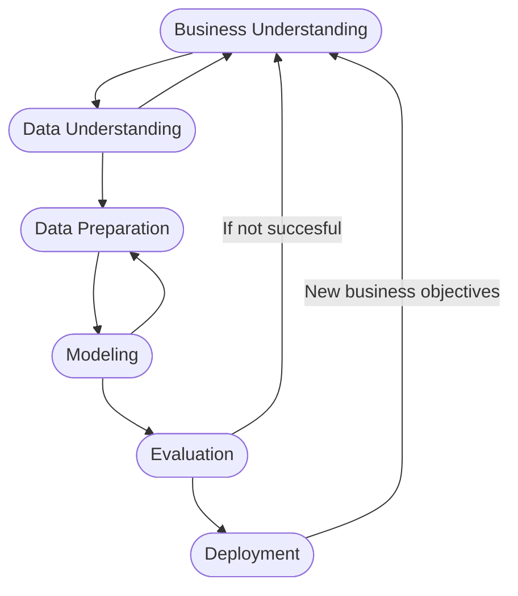

# 4. Project Plan: AI Curated Art Exhibition Assistant

## 4.1. Overview

The project is structured around iterative cycles following CRISP-DM, beginning with a feasibility exploration (using a limited subset and simple models) and refining the approach in subsequent iterations. The goal is a working prototype meeting success criteria, or delivering maximal insight within the time available.

## 4.2. Timeline

```mermaid
gantt
    title First Iteration in Working Days
    dateFormat  X
    axisFormat %s

    section Business
    Business Understanding : 0, 2

    section Preparation
    Data Preparation : 2, 3

    section Modeling
    Modeling : 3, 4

    section Evaluation
    Evaluation & Decision : 4, 5

    section Open days
    Next iteration/Open Days : 5, 8
```

| Stage | Description | Dependencies |
|---|---|---|
| Business/Data Understanding | Clarify objectives and explore the toy dataset. | None |
| Data Preparation | Clean, preprocess, and explore data; start with subset, later with more/cleaned data as needed. | Data Understanding |
| Modeling| Train a basic model (simple CNN, transfer learning with frozen layers); use part of dataset | Data Preparation |
| Evaluation | identify problems and strenghts. Decide whether issues are data, model-related, or both. | Modeling |
| **Decision Point 1** | If results meet initial expectations continue with improvements. If not: shedule meeting with advisors to set new targets | Evaluation |

*Total planned: 8 working days. Current plan for first iteration leaves 3 days open*

## 4.3. Iterations and Feedback Loops

- The first modeling/evaluation cycle serves as a *learning/prototyping* round. The expectation is to find bottlenecks or other issues here
- Based on what the learnings are:
    - **Data Preparation** may be revisited (cleaning, balancing, selecting different label subsets)
    - **Modeling** may switch from transfer learning to custom CNN, or explore different feature combinations
    - **Evaluation** after each cycle determines whether to iterate or deploy.
- *Iteration limit:* If the first iteration shows no feasability this will be discussed with advisors. Otherwise there will be at least one full iteration after the initial feasibility round. Further iterations depend on remaining time and whether the project is close to the succes criteria

## 4.4. Evaluation Strategy

- **First Iteration:** Qualitative/quantitative review & baseline accuracy.
- **Next Iterations:** Accuracy for grouping/classification, How does NLP fit into the project
*If not feasable, focus on reporting insights and demonstrating learning/progress.*

## 4.5. Time vs. Risk Analysis

- If major issues are found (e.g., all models fail, or labels unusable), the scope will be adapted after meeting with advisors.
- If compute is too slow, time is spent on accessing GPU. If not usable only pre-trained models will be used with and finetuned.
- If no there is no time left before reaching the target accuracy, the best working prototype and a full report of what was learned will be delivered.

## 4.6. Flowchart project

*Note:
For visual clarity, only the primary feedback loops are shown.
It is also possible to move from Evaluation back to Modeling, to try new models or hyperparameters or from Evaluation back to Data Preparation, to fix data issues. These additional arrows are omitted here to keep the flow easy to read*

# 4.7. Summary
The plan anticipates at least one full feedback loop between modeling, evaluation, and data preparation, allowing for learning and refinement.

The focus is on building a functional prototype and extracting insights, with a flexible approach if the first solution does not work as expected.